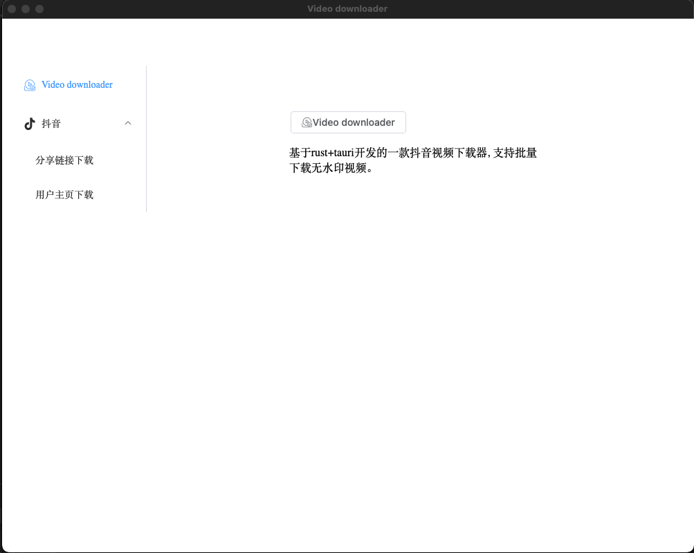
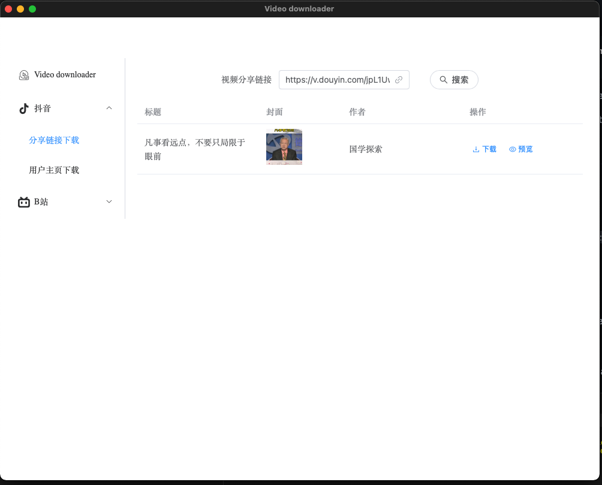
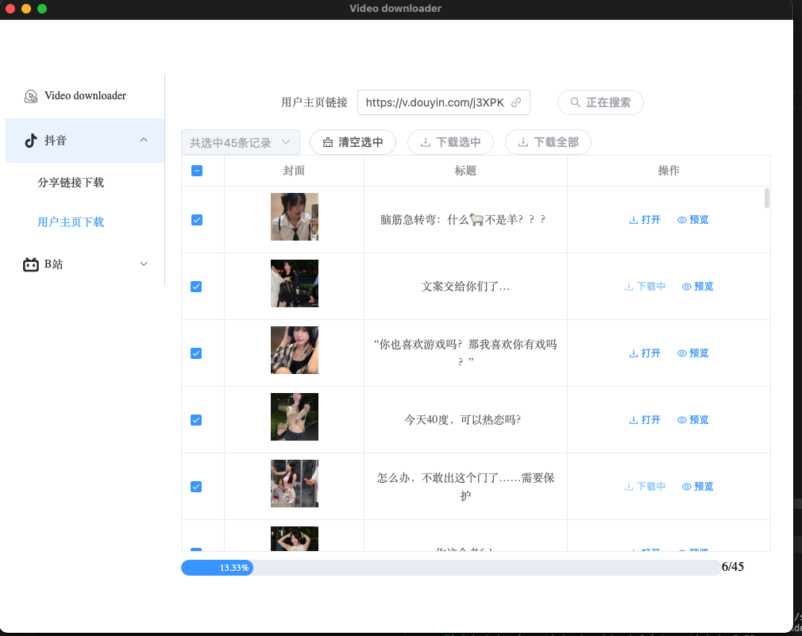

<h1 align="center">
  
  <br>
  Video Downloader
  <br>
</h1>

<h3 align="center">
 Cross-platform video(Douyin/Bilibili) download tool built with <a href="https://github.com/tauri-apps/tauri">tauri</a>.
</h3>
<div align="center">

[](https://github.com/ClassmateLin/douyin-downloader/releases)
[](https://github.com/ClassmateLin/douyin-downloader/releases)
[](https://github.com/ClassmateLin/douyin-downloader/releases)

</div>

[中文文档](./README_cn.md)

## Install


Download from [release](https://github.com/ClassmateLin/douyin-downloader/releases). Supports Windows x64, Linux x86_64 and macOS 11+

Or you can build it yourself. Supports Windows, Linux and macOS 10.15+

Notes: If you could not start the app on Windows, please check that you have Webview2 installed.


## Development

**You should install Rust and Nodejs.**

- Pull code and install dependencies:

```
$ git clone https://github.com/ClassmateLin/douyin-downloader.git && cd douyin-downloader
$ npm install
```

- Starting the development server can be done with: `npm run tauri dev`


- Creating a build can simply be done with: `npm run tauri build`


## 🎉 Features / Todos

### Douyin

#### Single video download

- [x] Search video by sharing link. eg: `https://v.douyin.com/jpL1UwY/` or `5.30 WZZ:/ 复制打开抖音，看看【选书人的作品】# 人生感悟 # 哲理人生 # 书单 # 智慧人生 @抖音... https://v.douyin.com/643hUux/`
- [x] Preview the searched video.
- [x] Download the searched video.

#### Multiple video download

- [x] Search all videos by user homepage url. eg: `https://v.douyin.com/j3XPKMg/` or `8- 长按复制此条消息，打开抖音搜索，查看TA的更多作品。 https://v.douyin.com/64w7StG/`
- [x] Download all videos in batch.
- [x] Batch download selected videos.
- [x] Download/preview a single video in a table.


## Screenshot






